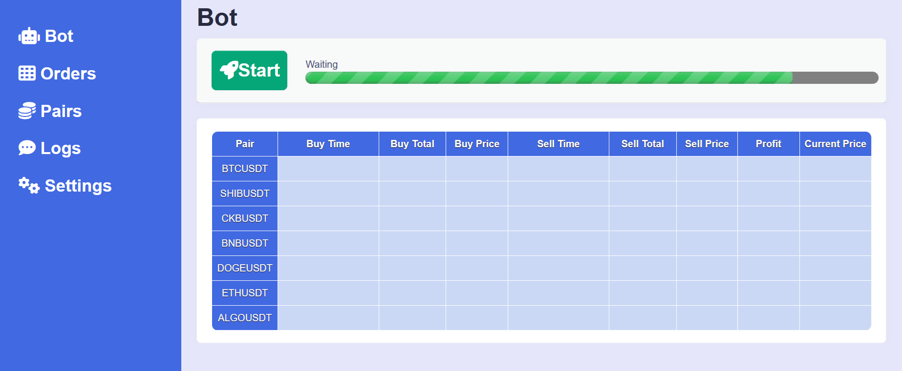
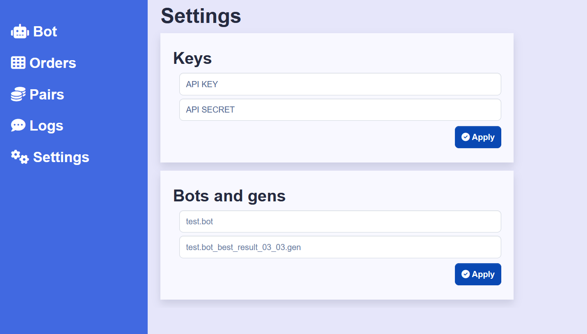

# BotManager

BotManager is a Django-based web application designed to manage and operate trading bots for cryptocurrency exchanges. This application allows users to configure pre-trained bots, monitor their trading activities, and manage various trading parameters through an intuitive interface.

**Note**: This project is a part of a larger ecosystem designed for advanced trading strategies using neural networks and genetic algorithms. Bot training is conducted using the GANN program.

## Features

- **Bot Configuration**: Easily configure the parameters and settings for pre-trained trading bots.
- **Order Management**: Monitor and manage all trading orders executed by the bots.
- **Pair Selection**: Choose and configure cryptocurrency pairs for trading.
- **Log Review**: View detailed logs of all bot activities and trades.
- **Settings Adjustment**: Customize global and individual bot settings to optimize trading performance.

## Project Structure

- **`bot/`**: Handles the main functionalities for running the trading bots.
- **`orders/`**: Manages the tracking and status of trading orders.
- **`pairs/`**: Contains functionalities related to managing trading pairs.
- **`logs/`**: Stores and displays logs of bot activities and trades.
- **`settings/`**: Provides interfaces for adjusting global and bot-specific settings.

## How to Use

### Database Setup

1. Create a virtual environment and activate it:
   ```bash
   python -m venv venv
   call venv\Scripts\activate.bat
   ```

2. Install the required packages:
   ```bash
   pip install -r requirements.txt
   ```

3. Set up the database schema by making and applying migrations:
   ```bash
   python manage.py makemigrations
   python manage.py migrate
    ```
   
4. Create a superuser account to access the Django admin interface:
   ```bash
   python manage.py createsuperuser
   ```
   
### Running the Application

To start the Django application, use the following command:
   ```bash
   python manage.py runserver
   ```
Visit `http://127.0.0.1:8000/` in your browser to access the application.

**Requires the `engine` C++ file.**

### Screenshot

Below is a screenshot of the application:



